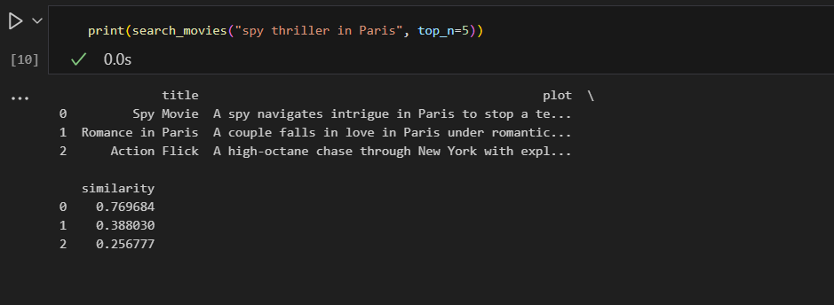
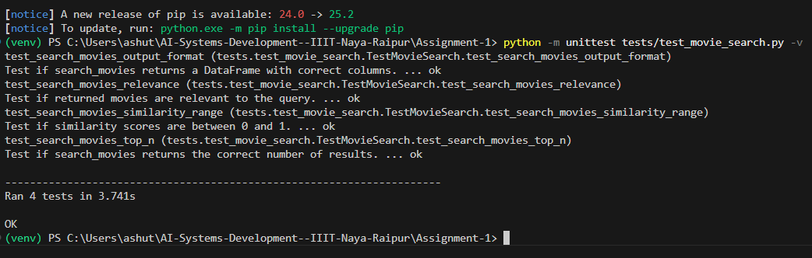

#  Assignment-1: Semantic Search on Movie Plots

##  Student Details
- **Name:** Ashutosh Singh  
- **Branch:** DSAI (Data Science and Artificial Intelligence)  
- **Year:** 4th Year  
- **Roll Number:** 221020418  

---

##  Overview
In this assignment, I built a **Semantic Search Engine for Movie Plots** using the **SentenceTransformers (all-MiniLM-L6-v2)** model.  

The workflow included:
1. Loading the `movies.csv` dataset containing movie titles and plot summaries.  
2. Encoding plots into vector embeddings using **SentenceTransformers**.  
3. Implementing a search function `search_movies(query, top_n)` that ranks movies by **cosine similarity** between query and plot embeddings.  
4. Testing with queries like `"spy thriller in Paris"`.  
5. Verifying the solution by running **unit tests** (all passed ✅).  

---

##  Setup & Running Instructions

### 1. Clone Repository
```bash
git clone https://github.com/ashutosh22102/AI-Systems-Development--IIIT-Naya-Raipur.git
cd Assignment-1
```
### 2. Create Virtual Environment
```
python -m venv venv
```
### 3. Activate Virtual Environment

Windows:
```
venv\Scripts\activate
```

macOS/Linux:
```
source venv/bin/activate
```
### 4. Install Dependencies
```
pip install -r requirements.txt
```

### 5. Run Notebook

The notebook **`movie_search_solution.ipynb`** is already included in the repository.  
Simply **open it in your IDE (e.g., VS Code, Jupyter Lab, or any notebook viewer)** and **run all cells** to see the results of the semantic search queries.

---

### 6. Run Unit Tests

Open a terminal in the project folder and run the following command:

```bash
python -m unittest tests/test_movie_search.py -v
```

###  Results & Screenshots

**Notebook Query Results** (e.g., running the query "spy thriller in Paris").



---

**Unit Test Results** (all 4 tests passing in terminal).


